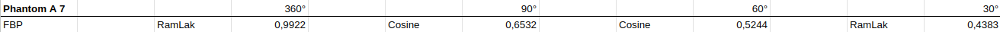

# Applied Optimization Methods for Inverse Problems

Repository to solve the Helsinki Tomography Challenge 2022, while also exploring a wide range of optimization methods
for inverse problems.

This was mainly done as part of the practical course "Applied Optimization Method for Inverse Problems" offered during
the summer term 2023 at TUM.

## Getting started

#### Poetry

The easiest and recommended way to install is using `poetry` (see
[here](https://python-poetry.org/)). Once you've installed `poetry`,
run `poetry install` from the root directory.

Next, we miss the dependency on `elsa` (see
[here](https://gitlab.lrz.de/IP/elsa)), the tool for tomographic
reconstruction. First run `poetry shell`, which will activate the virtual
environment created by `poetry`, then clone `elsa` to a new directory,
move into the directory and run `pip install . --verbose` (the `--verbose` is
optional, but then you'll see the progress).

From now, you can either activate the virtual environment by running `poetry shell`,
or you run `poetry run python myscript`, which will activate the environment for
that single command.

#### Classic

If you do not want to use `poetry`, you can use virtual environments.
From the root directory of this repository run `python -m venv /path/to/venv`, activate
it using `source /path/to/venv/bin/activate`, and then install everything with
`pip install --editable .` (from the root directory). Feel free to use the requirement.txt file.

Then again you need to install `elsa`. Follow the steps described above in
the `poetry` section.

### Getting the data for the Helsinki Tomography Challenge

To get the dataset for the challenge, head over to
[Zenodo](https://doi.org/10.5281/zenodo.7418878) and download the `htc2022_test_data.zip`. Extract it to a folder and
you should be good to go.
In the folder you will see a couple of different files.

`.mat` files contain the actual measurements/sinogram, which are needed for
reconstruction. There are the full measurements, one with limited number of
projections and example reconstructions of both. Further, there are segmented
files, which show the required binary thresholding segmentation done to
evaluate the score (again for full data and limited). However, for convenience the scoring is already implemented in
challenge/utils.py and can be used that way.
Finally, there are a couple of example images.

### Troubleshooting

If you have trouble installing `elsa` , see the README
of `elsa`. If you use an Ubuntu based distro and want to use CUDA, you might
need to set `CUDA_HOME`, to wherever CUDA is installed.

Please note, that you do not need CUDA, but it might speed up your
reconstructions quite dramatically.

## Results

### Process

For the challenge, I decided to focus my efforts initially on the phantom A with difficulty 7, look at the
various angle cases and then try to apply the gained knowledge to the other phantoms.

#### 1. Determine best starting point with FBP (Filtered BackProjection)

At first, I wanted to establish some baseline, so I ran FBP for the various angle cases and played a bit around with
filters to also get the best starting point for further optimization. I also experimented with cosine weighting, but
this only led to worse results.

The established baselines were the following:

One notices that the full arc case is basically solved with FBP already. Nonetheless, I decided to keep the full arc
case for now.

Before starting further investigation, I implemented a cropping algorithm.
I tried to detect the disc by finding the maximum gradient and using this as a radius, which seemed to work quite well,
while also being relatively fast to compute, especially since the distances can precomputed.
This improved the baselines quite substantially for the lower angles cases, as it removed artefacts:

#### 2. Choosing promising formulations

The next step was to search for the best problem description of each case, while also trying to find an algorithm that
solves it quickly.

The formulations I decided to try are the following 7:

- Least squares
- Tihkonov
- Least squares with Huber loss
- Least squares with Fair loss
- Lasso
- Elastic net
- Isotropic TV with Central Differences

#### 3. Determining formulation/algorithm combinations and optimizer setup

Starting with those formulations, the next step was finding algorithms, step size schedulers and hyperparameters that
solve them well. The idea was to have one simple algorithm, which serves as another robust reference, and otherwise the
most sophisticated algorithms.

This meant for the first 4 differentiable formulations, I chose the following algorithms:

- Gradient descent with a BarzilaiBorwein step size scheduler
- ADAM with a constant step size
- OGM with a constant step size
- CG

For the Lasso and Elastic Net formulation, I chose the following algorithms:

- Proximal gradient with a constant step size
- OPGM with a constant step size
- ADMM with a constant step size and tau=100

While Isotropic TV is only solvable via ADMM.

Furthermore, I tried all those combinations with 2 different runners:

- plain runner: that just ran 200 iterations and
- fancy runner: who had the same iteration budget but also used early stopping with patience of 10 and restarting
  whenever the patience decreased.

All had an initial step size of 1/2*L, where L is the Lipschitz Constant, and the previously discussed fbp as initial guess.
This resulted in a total of 184 runs for all angle cases.

For the choice of runners, I had a look at the convergence plots of the different algorithms and compared the runners,
showing all of them would probably be too much, so I decided to only show the 360° case, as it is representative for
all of them:

Most notable ADAM really does not work well with restarts, and furthermore, restarts did not seem to improve convergence
in any scenario, besides conjugate gradient and temporarily ADMM, but the improvement is not substantial if the
iteration is stopped early.
However, the fancy runner did in general achieve similar loss with fewer iterations, therefore, I decided
to keep early stopping, but not restart and also double the maximum number of iterations to 400. Furthermore, I
increased the patience to 40 iterations, to be able to cross ADMMs oscillations.

The best results in this run were achieved by the following formulation/algorithm combinations:

Based on the following convergence plots for the plain runner:

I decided to keep the following combinations of formulations and algorithms:

- Least squares: Gradient descent with BarzilaiBorwein step size scheduler
- Tihkonov: CG & Gradient descent with BarzilaiBorwein step size scheduler
- Least squares with Huber loss: OGM
- Least squares with Fair loss: OGM
- Lasso: OPGM & ADMM
- Elastic net: OPGM & ADMM
- Isotropic TV with Central Differences: ADMM

#### 4. Comparing formulations and exploring formulation parameters

Continuing with the chosen formulations and algorithms, I decided to explore the parameters of the formulations with
the following sweep:

- Least squares: no parameters
- Tihkonov: regularization strength sweep [logspace(-5, 0, 10)]
- Least squares with Huber loss: regularization strength & delta sweep [logspace(-5, 0, 10), np.logspace(-3, -1, 3)]
- Least squares with Fair loss: regularization strength & delta sweep [logspace(-5, 0, 10), np.logspace(-3, -1, 3)]
- Lasso: regularization strength sweep [logspace(-5, 0, 10)]
- Elastic net: regularization strength sweep for both norms [logspace(-5, 0, 10), np.linspace(-5, 0, 5)] less
  exploration
  for the l2 norm
- Isotropic TV with Central Differences: regularization strength sweep [logspace(-5, 0, 10)]

This, together with the algorithms, resulted in a total of 211 runs per arc, which took roughly 2 hours to compute.
The best scores achieved in this run were the following:

#### 5. Trim combinations and formulations

Looking at the best results each formulation could achieve in the following run, I tried to reduce the number of
possible runs by removing outscored formulations and combinations. The left combinations were the following:

- 360°
    - Least squares with Huber(beta=0.0215, delta=0.01): OGM
- 90°
    - Lasso(beta=0.0774): OPGM
    - Least squares with Huber(beta=1, delta=0.01): OGM
- 60°
    - Lasso(beta=0.0774): OPGM
    - Least squares with Huber(beta=1, delta=0.01): OGM
- 30°
    - Lasso(beta=0.0004641): OPGM
    - TVRegularization(beta=0.0215): ADMM
    - Elastic net(beta=1e5,beta2=1): ADMM

with this trimming, only 8 runs remained per phantom.
Before finalizing and extrapolating to the other phantoms. I wanted to revisit the parameters for the Huber formulation
in the 60° and 90° arc, as well as the elastic net formulation in the 30° arc, as they were at the edge of the
swept parameter range.
This led to another 100 runs, which took roughly 20 min to compute and updated the parameters as following:

- 360°
    - Least squares with Huber(beta=0.0215, delta=0.01): OGM
- 90°
    - Lasso(beta=0.0774): OPGM
    - Least squares with Huber(beta=2.154, delta=0.01): OGM
- 60°
    - Lasso(beta=0.0774): OPGM
    - Least squares with Huber(beta=0.7742, delta=0.01): OGM
- 30°
    - Lasso(beta=0.0004641): OPGM
    - TVRegularization(beta=0.0215): ADMM
    - Elastic net(beta=10,beta2=1): ADMM

#### 6. Extrapolate to other phantoms and Squeeze

Finally, the results from the one phantom were extrapolated to the other phantoms and the maximum iterations were
increased to 1000.
This resulted in 168 runs, which took roughly half an hour to compute.

My final best scores and their associated parameters are the following:

ARC: 360

 Phantom | Difficulty | Score      | i   | n_iter | Formulation      | Method             
---------|------------|------------|-----|--------|------------------|--------------------
 a       | 1          | 0.99911337 | 111 | 452    | LSDfRFormulation | optimized_gradient 
 a       | 2          | 0.99836131 | 172 | 303    | LSDfRFormulation | optimized_gradient 
 a       | 3          | 0.99871893 | 108 | 320    | LSDfRFormulation | optimized_gradient 
 a       | 4          | 0.99780540 | 200 | 308    | LSDfRFormulation | optimized_gradient 
 a       | 5          | 0.99710220 | 118 | 305    | LSDfRFormulation | optimized_gradient 
 a       | 6          | 0.99777936 | 131 | 309    | LSDfRFormulation | optimized_gradient 
 a       | 7          | 0.99592590 | 133 | 291    | LSDfRFormulation | optimized_gradient 
 b       | 1          | 0.99889755 | 110 | 180    | LSDfRFormulation | optimized_gradient 
 b       | 2          | 0.99765429 | 213 | 314    | LSDfRFormulation | optimized_gradient 
 b       | 3          | 0.99780123 | 156 | 303    | LSDfRFormulation | optimized_gradient 
 b       | 4          | 0.99709347 | 179 | 325    | LSDfRFormulation | optimized_gradient 
 b       | 5          | 0.99710042 | 172 | 295    | LSDfRFormulation | optimized_gradient 
 b       | 6          | 0.99804756 | 92  | 309    | LSDfRFormulation | optimized_gradient 
 b       | 7          | 0.99701880 | 92  | 297    | LSDfRFormulation | optimized_gradient 
 c       | 1          | 0.99832031 | 152 | 321    | LSDfRFormulation | optimized_gradient 
 c       | 2          | 0.99895954 | 100 | 307    | LSDfRFormulation | optimized_gradient 
 c       | 3          | 0.99808751 | 93  | 321    | LSDfRFormulation | optimized_gradient 
 c       | 4          | 0.99817051 | 95  | 326    | LSDfRFormulation | optimized_gradient 
 c       | 5          | 0.99698048 | 126 | 310    | LSDfRFormulation | optimized_gradient 
 c       | 6          | 0.99749203 | 151 | 183    | LSDfRFormulation | optimized_gradient 
 c       | 7          | 0.99792990 | 160 | 312    | LSDfRFormulation | optimized_gradient 

ARC: 90

 Phantom | Difficulty | Score      | i   | n_iter | Formulation      | Method                      
---------|------------|------------|-----|--------|------------------|-----------------------------
 a       | 1          | 0.98315684 | 0   | 48     | LassoFormulation | optimized_proximal_gradient 
 a       | 2          | 0.97160876 | 110 | 1000   | LSDfRFormulation | optimized_gradient          
 a       | 3          | 0.94341835 | 412 | 1000   | LSDfRFormulation | optimized_gradient          
 a       | 4          | 0.95396707 | 124 | 1000   | LSDfRFormulation | optimized_gradient          
 a       | 5          | 0.94761390 | 467 | 1000   | LSDfRFormulation | optimized_gradient          
 a       | 6          | 0.88822590 | 490 | 1000   | LSDfRFormulation | optimized_gradient          
 a       | 7          | 0.88385510 | 421 | 1000   | LSDfRFormulation | optimized_gradient          
 b       | 1          | 0.95903665 | 130 | 1000   | LSDfRFormulation | optimized_gradient          
 b       | 2          | 0.95546577 | 125 | 1000   | LSDfRFormulation | optimized_gradient          
 b       | 3          | 0.92124738 | 0   | 50     | LassoFormulation | optimized_proximal_gradient 
 b       | 4          | 0.85531617 | 105 | 1000   | LSDfRFormulation | optimized_gradient          
 b       | 5          | 0.93823663 | 434 | 1000   | LSDfRFormulation | optimized_gradient          
 b       | 6          | 0.83720253 | 528 | 1000   | LSDfRFormulation | optimized_gradient          
 b       | 7          | 0.87818244 | 142 | 1000   | LSDfRFormulation | optimized_gradient          
 c       | 1          | 0.95233803 | 108 | 1000   | LSDfRFormulation | optimized_gradient          
 c       | 2          | 0.95991236 | 0   | 49     | LassoFormulation | optimized_proximal_gradient 
 c       | 3          | 0.91283543 | 454 | 1000   | LSDfRFormulation | optimized_gradient          
 c       | 4          | 0.93823993 | 108 | 1000   | LSDfRFormulation | optimized_gradient          
 c       | 5          | 0.87203141 | 483 | 1000   | LSDfRFormulation | optimized_gradient          
 c       | 6          | 0.93357335 | 120 | 1000   | LSDfRFormulation | optimized_gradient          
 c       | 7          | 0.94400170 | 107 | 1000   | LSDfRFormulation | optimized_gradient          

ARC: 60

 Phantom | Difficulty | Score      | i   | n_iter | Formulation      | Method                      
---------|------------|------------|-----|--------|------------------|-----------------------------
 a       | 1          | 0.97581547 | 0   | 43     | LassoFormulation | optimized_proximal_gradient 
 a       | 2          | 0.94439732 | 428 | 1000   | LSDfRFormulation | optimized_gradient          
 a       | 3          | 0.86466503 | 495 | 1000   | LSDfRFormulation | optimized_gradient          
 a       | 4          | 0.81652094 | 617 | 1000   | LSDfRFormulation | optimized_gradient          
 a       | 5          | 0.86991124 | 523 | 1000   | LSDfRFormulation | optimized_gradient          
 a       | 6          | 0.86431890 | 437 | 1000   | LSDfRFormulation | optimized_gradient          
 a       | 7          | 0.84978890 | 506 | 1000   | LSDfRFormulation | optimized_gradient          
 b       | 1          | 0.92504951 | 507 | 1000   | LSDfRFormulation | optimized_gradient          
 b       | 2          | 0.89841847 | 534 | 1000   | LSDfRFormulation | optimized_gradient          
 b       | 3          | 0.78610247 | 491 | 1000   | LSDfRFormulation | optimized_gradient          
 b       | 4          | 0.78565684 | 428 | 1000   | LSDfRFormulation | optimized_gradient          
 b       | 5          | 0.86656066 | 523 | 1000   | LSDfRFormulation | optimized_gradient          
 b       | 6          | 0.79117909 | 0   | 43     | LassoFormulation | optimized_proximal_gradient 
 b       | 7          | 0.75971128 | 540 | 1000   | LSDfRFormulation | optimized_gradient          
 c       | 1          | 0.89991305 | 538 | 1000   | LSDfRFormulation | optimized_gradient          
 c       | 2          | 0.86561725 | 609 | 1000   | LSDfRFormulation | optimized_gradient          
 c       | 3          | 0.86056884 | 432 | 1000   | LSDfRFormulation | optimized_gradient          
 c       | 4          | 0.78753502 | 488 | 1000   | LSDfRFormulation | optimized_gradient          
 c       | 5          | 0.83520899 | 0   | 48     | LassoFormulation | optimized_proximal_gradient 
 c       | 6          | 0.86982834 | 451 | 1000   | LSDfRFormulation | optimized_gradient          
 c       | 7          | 0.87492935 | 512 | 1000   | LSDfRFormulation | optimized_gradient          

ARC: 30

 Phantom | Difficulty | Score      | i | n_iter | Formulation                 | Method 
---------|------------|------------|---|--------|-----------------------------|--------
 a       | 1          | 0.97522754 | 2 | 66     | TVRegularizationFormulation | admm   
 a       | 2          | 0.86904071 | 3 | 66     | TVRegularizationFormulation | admm   
 a       | 3          | 0.82638661 | 4 | 573    | ElasticNetFormulation       | admm   
 a       | 4          | 0.78936320 | 4 | 66     | TVRegularizationFormulation | admm   
 a       | 5          | 0.85047692 | 3 | 539    | ElasticNetFormulation       | admm   
 a       | 6          | 0.81374212 | 3 | 67     | TVRegularizationFormulation | admm   
 a       | 7          | 0.80093117 | 4 | 66     | TVRegularizationFormulation | admm   
 b       | 1          | 0.90751182 | 6 | 66     | TVRegularizationFormulation | admm   
 b       | 2          | 0.86670303 | 4 | 540    | ElasticNetFormulation       | admm   
 b       | 3          | 0.74334419 | 4 | 574    | ElasticNetFormulation       | admm   
 b       | 4          | 0.65569374 | 4 | 67     | TVRegularizationFormulation | admm   
 b       | 5          | 0.84435297 | 3 | 66     | TVRegularizationFormulation | admm   
 b       | 6          | 0.78933489 | 3 | 67     | TVRegularizationFormulation | admm   
 b       | 7          | 0.74354104 | 4 | 66     | TVRegularizationFormulation | admm   
 c       | 1          | 0.80041927 | 4 | 66     | TVRegularizationFormulation | admm   
 c       | 2          | 0.84188645 | 3 | 142    | ElasticNetFormulation       | admm   
 c       | 3          | 0.81581281 | 4 | 66     | TVRegularizationFormulation | admm   
 c       | 4          | 0.67804736 | 3 | 66     | TVRegularizationFormulation | admm   
 c       | 5          | 0.82568818 | 4 | 66     | TVRegularizationFormulation | admm   
 c       | 6          | 0.77035164 | 4 | 67     | TVRegularizationFormulation | admm   
 c       | 7          | 0.76017163 | 4 | 66     | TVRegularizationFormulation | admm   

And finally, the associated reconstructions compared to ground truth:

